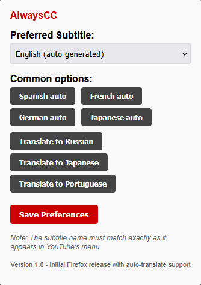

# AlwaysCC

<div align="center">


**Never miss a word on YouTube again - automatically enable captions on every video**

[](https://opensource.org/licenses/MIT)
[](https://github.com/oop7/AlwaysCC)

</div>

## Overview

AlwaysCC is a Firefox extension that automatically enables closed captions on YouTube videos and lets you choose your preferred subtitle language or translation. No more manually clicking the CC button every time!

## Features

- **Auto-Enable**: Automatically turns on captions when you watch YouTube videos
- **Language Selection**: Choose your preferred subtitle language
- **Auto-Translation**: Select "auto-translate" to any supported language
- **Custom Options**: Enter exact caption names for perfect matching
- **Quick Presets**: One-click buttons for common subtitle options
- **Seamless Experience**: Works behind the scenes without disrupting your viewing

## Installation

> **Note:** This extension is currently pending review for the Firefox Add-ons Store. The following installation methods are available in the meantime.

### Manual Installation

1. Download this repository (`git clone https://github.com/oop7/AlwaysCC.git` or download ZIP)
2. Open Firefox and go to `about:debugging`
3. Click "This Firefox"
4. Click "Load Temporary Add-on..."
5. Select any file from the extension folder

### Development Installation (with signature bypass)

Firefox requires extensions to be signed, but for development you can bypass this:

1. In Firefox, type `about:config` in the address bar
2. Accept the warning
3. Search for `xpinstall.signatures.required`
4. Double-click to toggle its value to `false`
5. Restart Firefox
6. Install the extension by opening the .xpi file directly

This method only works in Firefox Developer Edition, Firefox Nightly, or Firefox ESR.

### Coming Soon to Firefox Add-ons Store

Once approved, the extension will be available for easy installation directly from the Firefox Add-ons Store. The review process typically takes a few days to complete.

## Usage

1. After installation, click the AlwaysCC icon in your browser toolbar
2. Select your preferred subtitle option:
   - Choose from the dropdown menu
   - Use one of the preset buttons
   - Enter a custom subtitle name
3. Click "Save Preferences"
4. That's it! AlwaysCC will now automatically enable your preferred subtitles on all YouTube videos



## How It Works

AlwaysCC monitors YouTube pages and:
1. Detects when a video is loaded
2. Checks if captions are already enabled
3. Enables captions if needed
4. Navigates YouTube's menu system to select your preferred subtitle option
5. Handles auto-translate selection when needed

The extension is designed to be lightweight and only activates on YouTube pages.

## Development

### Prerequisites

- Firefox browser
- Basic knowledge of JavaScript, HTML, and CSS

### Setup

1. Clone the repository:
   ```
   git clone https://github.com/oop7/AlwaysCC.git
   ```

2. Make your changes to the code

3. Test the extension:
   - Open Firefox and go to `about:debugging`
   - Click "This Firefox"
   - Click "Load Temporary Add-on..."
   - Select any file from the extension folder

4. Package the extension:
   - Run the included `package.bat` script
   - The XPI file will be created in the `build` directory

### Project Structure

- `manifest.json` - Extension configuration
- `content.js` - Core functionality that runs on YouTube pages
- `popup.html` & `popup.js` - User interface for settings
- `icons/` - Extension icons
- `package.bat` - Packaging script

## Contributing

Contributions are welcome! Please feel free to submit a Pull Request.

1. Fork the repository
2. Create your feature branch (`git checkout -b feature/amazing-feature`)
3. Commit your changes (`git commit -m 'Add some amazing feature'`)
4. Push to the branch (`git push origin feature/amazing-feature`)
5. Open a Pull Request

## License

This project is licensed under the MIT License - see the [LICENSE](LICENSE) file for details.

## Acknowledgments

- Thanks to all contributors and users of AlwaysCC
- Built with love for the hearing-impaired community and language learners

---

<div align="center">
  <sub>Made by <a href="https://github.com/oop7">oop7</a> with ❤️</sub>
</div> 